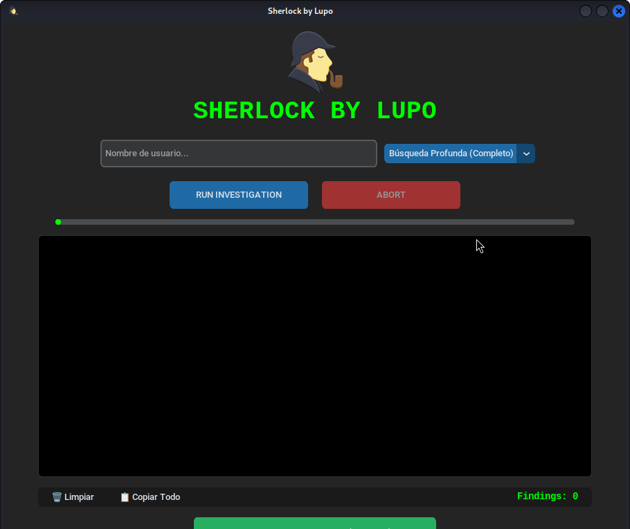

# 🔍 Sherlock by Lupo - OSINT Tool



[ES] Una herramienta de investigación de fuentes abiertas (OSINT) con interfaz gráfica avanzada, diseñada para entornos Linux (especialmente Kali Linux).

[EN] An Open Source Intelligence (OSINT) tool with an advanced graphical interface, designed for Linux environments (especially Kali Linux).

---

## 🚀 Características | Features

### [ES]
*   **Búsqueda Multinivel:** Filtros para redes sociales rápidas o búsqueda profunda.
*   **Reportes de Auditoría:** Generación automática de reportes en PDF y TXT con marca de tiempo.
*   **Interfaz Moderna:** Construida con CustomTkinter para un look "Cyberpunk/Dark Mode".
*   **Portabilidad:** Rutas dinámicas que permiten ejecutar el proyecto desde cualquier directorio.

### [EN]
*   **Multilevel Search:** Filters for fast social media or deep search.
*   **Audit Reports:** Automatic generation of PDF and TXT reports with timestamps.
*   **Modern UI:** Built with CustomTkinter for a "Cyberpunk/Dark Mode" aesthetic.
*   **Portability:** Dynamic paths allow running the project from any directory.

---

## 🛠️ Instalación Rápida | Quick Installation

Sigue estos pasos en tu terminal | Follow these steps in your terminal:
```bash
# Clonar el repositorio | Clone the repository
git clone [https://github.com/Lupo-SysAdmin/Sherlock-GUI.git](https://github.com/Lupo-SysAdmin/Sherlock-GUI.git)

# Entrar a la carpeta | Enter the folder
cd Sherlock-GUI

# Ejecutar el instalador automático | Run the automatic installer
chmod +x setup.sh
./setup.sh
